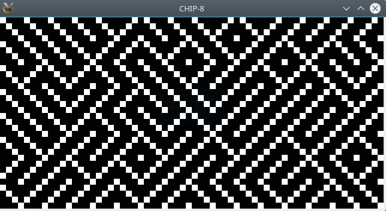
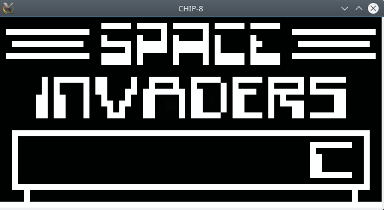
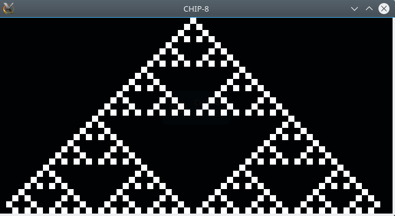

#Chip-8 Emulator (SFML and C++).

## Screenshots

Maze:
<br>

<br>

Space invaders:
<br>

<br>

Sierpinski triangle:
<br>

<br>

##Building/Running.

Requires SFML.

```
sudo apt-get install libsfml-dev

```
<br>

Compiling:

```
g++ -o main main.cpp -lsfml-graphics -lsfml-window -lsfml-system

```
<br>

Running (example):

```
./main roms/maze.ch8
```


## Todo:

I think everything's as complete as possible. Maybe I will implement smoother rendering
in the future to reduce jitter.